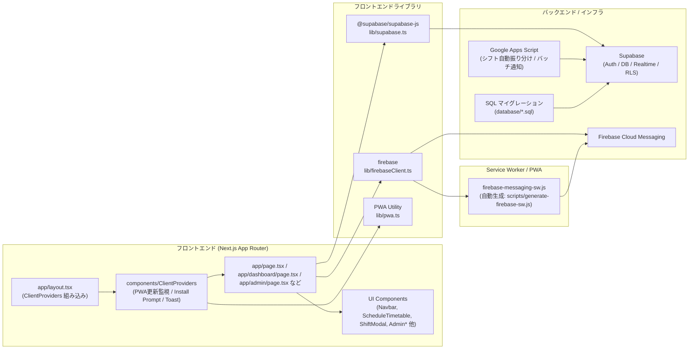

# 文化祭シフト管理システム

文化祭スタッフのシフト管理を行うための PWA（Progressive Web App）アプリケーションです。リアルタイム同期、プッシュ通知、オフライン対応、メンテナンスモード、団体付与シフト機能、チャット機能、そしてスムーズな UI アニメーションを備えています。

## 📋 目次

- [主な機能](#主な機能)
- [画面・機能一覧](#画面機能一覧)
- [操作方法](#操作方法)
- [システム構成図](#システム構成図)
- [依存関係図](#依存関係図)
- [技術スタック](#技術スタック)
- [セットアップ](#セットアップ)
- [環境変数](#環境変数)
- [コンポーネント一覧](#コンポーネント一覧)
- [開発](#開発)
- [ビルドとデプロイ](#ビルドとデプロイ)
- [アーキテクチャメモ](#アーキテクチャメモ)

## ✨ 主な機能

### 認証・ユーザー管理

- **Supabase 認証**: メールアドレスとパスワードによる認証システム。
- **ロールベースアクセス制御**: `admin`（管理者）と `staff`（スタッフ）の権限分離。
- **ログイン状態の永続化**: 最終ログインから 5 日間セッションを保持。古い端末情報・Push トークンは自動クリーンアップ。
- **メンテナンスモード**: 管理者がシステムをメンテナンス状態に切り替え可能（一般ユーザーは専用画面にリダイレクト）。

### 🎨 UI/UX・PWA

- **PWA 対応**: インストール可能で、オフラインでも一部機能が動作。ホーム画面に追加してネイティブアプリのように利用可能。
- **iOS / Android 対応**: iOS のホーム画面追加・通知にも対応した Service Worker / FCM 実装。
- **スムーズなモード切り替え**: 管理者モードと通常モード（スタッフビュー）をアニメーション付きでスムーズに切り替え。
- **レスポンシブデザイン**: PC、タブレット、スマートフォン全てのデバイスで最適化されたレイアウト。

### 📅 シフト管理

#### 管理者機能
- **シフト作成・編集**: 個別シフト／団体付与シフト（`shift_groups`）をカレンダーから直感的に登録。
- **自動振り分け取り込み**: 外部 JSON データ（GAS 連携）からシフトを一括インポートし、DB に反映。
- **個別・団体シフト登録**: 個別のスタッフへの割り当てに加え、複数人への一括団体シフト登録が可能。
- **カレンダー・スプレッドシート表示**: 週・月カレンダーと、表形式（スプレッドシート）ビューを切り替え可能。
- **重複チェック**: 時間帯・タイトルなどをもとに、同一時間帯の重複を検知して登録ミスを防止。
- **統括者の設定**: 団体シフト内で統括者（リーダー）を 1 名設定可能。

#### ユーザー（スタッフ）機能
- **タイムテーブル表示**: 当日のスケジュールを **縦型タイムテーブル** で分かりやすく表示（6:00–22:00）。
- **自分専用ダッシュボード**: 自分に紐づくシフトと、自分が統括者となっているシフトのみを統合表示。
- **シフト詳細確認**: シフトタイトル、時間帯、備考、参加メンバー、統括者の情報をモーダルで確認。
- **次のシフトカード**: 進行中／次のシフトをカード形式で強調表示。

### 🔔 プッシュ通知・システム通知

- **自動リマインダー**: シフト開始の 1 時間前・30 分前・5 分前に自動で Push 通知を送信（GAS + FCM）。
- **管理者からの連絡**: 特定ユーザー／シフトグループ単位で手動通知を送信可能（管理画面の通知タブ）。
- **重複表示防止ロジック**: FCM の `messageId` / tag を用いて、同一通知が複数端末・フォアグラウンド/バックグラウンドで二重表示されないよう制御。

### 💬 チャット・コミュニケーション

- **シフトグループチャット**: 団体付与されたシフトグループ単位でチャットルームを生成し、連絡を一元化。
- **既読管理**: 既読情報を Supabase で管理し、未読メッセージを把握可能。
- **通知連携**: 新着メッセージに応じた Push 通知送信（詳細は `database/README_CHAT_NOTIFICATION_FIX.md` および SQL を参照）。

## 🧭 画面・機能一覧

### 主要画面

| 画面 | URL | 対象ロール | 主な機能 |
|------|-----|------------|----------|
| ログイン | `/` | 全員 | メールアドレス・パスワードによるログイン、メンテナンス中の案内表示、Push 通知の初期登録。 |
| メンテナンス画面 | `/maintenance` | 一般ユーザー | システムメンテナンス中の案内表示。ログインセッションは維持されるが利用不可。 |
| スタッフダッシュボード | `/dashboard` | staff / admin（ユーザービュー） | 当日〜今後の自分のシフト表示、進行中/次シフトカード、シフト詳細表示。 |
| 管理画面トップ | `/admin` | admin | シフト管理・ユーザー管理・通知・チャット・各種設定・自動振り分けのハブ画面。 |

### 管理画面タブ構成

| タブ ID | 表示ラベル | 主担当コンポーネント | 概要 |
|--------|------------|-----------------------|------|
| `calendar` | シフト管理 | `AdminCalendar`, `ShiftModal` | 個別／団体シフトの作成・編集・削除。週／月カレンダーとモバイル専用カレンダーを提供。 |
| `users` | ユーザー管理 | `UserManagement` | プロフィール情報・ロール（admin/staff）の編集、アカウント管理。 |
| `notifications` | 通知 | `AdminNotifications` | 手動プッシュ通知の作成・送信履歴の管理。 |
| `chat` | チャット | `AdminChatManagement` | シフトグループチャットの作成・管理、問題発生時の確認。 |
| `settings` | 設定 | `AdminSettings` | メンテナンスモード切り替え、システム設定（`app_settings` テーブル）管理。 |
| `auto_assignment` | 自動振り分け | `ShiftImportComponent` | GAS から出力された JSON を読み込み、団体シフトを自動登録。 |

## 🕹 操作方法

### スタッフ向け（/dashboard）

- **ログイン**: 配布されたメールアドレス・パスワードで `/` からログインします。
- **シフト確認**:
  - 画面上部のカードで、進行中／次のシフトを確認できます。
  - 下部のタイムテーブルで、当日の全シフトが時間軸に沿って表示されます。
- **シフト詳細を見る**:
  - タイムテーブル上のシフトブロックをタップ／クリックすると、詳細モーダルが開きます。
  - 一緒に入るメンバー一覧、統括者名、備考（説明）が確認できます。
- **団体シフトの確認**:
  - 自分が参加している `shift_groups` のシフトも同じタイムテーブル上に表示されます。
  - 統括者として登録されている場合は、シフトタイトルに「（統括）」が付与されます。

### 管理者向け（/admin）

- **ログイン・モード切り替え**:
  - admin ロールでログインすると、初回は自動的に `/admin` に遷移します。
  - ビューモードは `localStorage` の `shift-app-view-mode` で保持され、`'admin'` / `'user'` を切り替えることで `/admin` ⇔ `/dashboard` を行き来できます（`Navbar` から切り替え）。

- **シフト管理タブ（calendar）**:
  - 週／月ビューで日付をクリックして新規シフトを作成できます。
  - 既存シフトをクリックすると編集モーダル（`ShiftModal`）が開き、時間・タイトル・担当者・統括者・色などを変更できます。
  - モバイルでは `AdminCalendar` による縦スクロール UI で同様の操作が可能です。

- **スプレッドシートビュー**:
  - 「表形式」ボタンを押すと `SpreadsheetView` が開き、ユーザー×時間のマトリクスでシフトを一覧できます。

- **自動振り分け（auto_assignment）**:
  - GAS 側で生成された JSON をアップロードし、`shift_groups` / `shift_assignments` テーブルに一括登録します。
  - エラー時は画面上で詳細メッセージが表示されます。

- **ユーザー管理（users）**:
  - プロフィール（表示名など）を編集し、admin / staff のロールを更新します。

- **通知管理（notifications）**:
  - 実行委員からスタッフへ連絡するための Push 通知を作成できます。
  - 特定のユーザー、またはシフトグループ単位で送信対象を指定可能です。

- **チャット管理（chat）**:
  - グループチャットの状況確認やトラブルシュートを行います。
  - 通知ポリシーの詳細や問題対応は `database/README_CHAT_NOTIFICATION_FIX.md` を参照してください。

- **システム設定（settings）**:
  - メンテナンスモードの ON/OFF を切り替え、メンバーへの影響を制御します。

### PWA・プッシュ通知の利用

- **PWA インストール手順**:
  - 開発環境での確認・インストール方法は `docs/PWA_使用方法.md` を参照してください。
  - 本番モード（`npm run build && npm start` あるいは Vercel デプロイ）でのみ PWA / Service Worker が有効になります。
- **通知許可**:
  - 初回ログイン時、あるいはログインボタン押下後にブラウザから通知権限が求められます。
  - 許可すると、端末ごとの Push トークンが `push_subscriptions` テーブルに登録されます。

## 🗺 システム構成図

アプリケーションの主要コンポーネントとデータフローの概要図です。

```mermaid
graph TD
    User[ユーザー] --> Login[ログインページ]
    Login --> Auth{認証チェック}
    Auth -->|Admin| AdminDash[管理者ダッシュボード]
    Auth -->|Staff| UserDash[ユーザーダッシュボード]

    subgraph "管理者機能 (Admin)"
        AdminDash --> Tab1[カレンダータブ]
        AdminDash --> Tab2[ユーザー管理タブ]
        AdminDash --> Tab3[通知管理タブ]
        AdminDash --> Tab4[設定タブ]
        AdminDash --> Tab5[自動振り分けタブ]
        
        Tab1 --> ShiftCreate[シフト作成・編集]
        Tab5 --> ShiftImport[シフトインポート機能]
        ShiftImport --> GAS[Google Apps Script連携]
    end

    subgraph "ユーザー機能 (User)"
        UserDash --> Timetable[タイムテーブル表示]
        UserDash --> DetailModal[シフト詳細モーダル]
        Timetable --> DayView[日別ビュー (縦型)]
        Timetable --> WeekView[週間ビュー]
    end

    subgraph "バックエンド / インフラ"
        Auth --> Supabase[(Supabase DB / Auth)]
        ShiftCreate --> Supabase
        ShiftImport --> Supabase
        GAS --> Supabase
        Supabase -->|Realtime| AdminDash
        Supabase -->|Realtime| UserDash
    end
```

## 🧱 依存関係図

フロントエンド、バックエンド、および外部サービス間の依存関係です。



## 🛠 技術スタック

### フロントエンド

- **Next.js 16**: App Routerを使用した最新のReactフレームワーク。
- **React 19**: 最新機能を使用したUI構築。
- **TypeScript**: 型安全性による堅牢なコード。
- **Tailwind CSS 4**: ユーティリティファーストなスタイリング。
- **framer-motion / CSS Animations**: スムーズな遷移エフェクト。

### バックエンド・インフラ

- **Supabase**: 認証、データベース、リアルタイム配信、RLS（行レベルセキュリティ）。
- **Firebase Cloud Messaging (FCM)**: プッシュ通知基盤。
- **Google Apps Script (GAS)**: 通知のバッチ処理および外部データ連携。

## 🚀 セットアップ

### 1. リポジトリのクローンとインストール

```bash
git clone <repository-url>
cd shift-app
npm install
```

### 2. 環境変数の設定

`.env.local`ファイルを作成し、以下の値を設定してください。

```bash
NEXT_PUBLIC_SUPABASE_URL=your_supabase_url
NEXT_PUBLIC_SUPABASE_ANON_KEY=your_supabase_anon_key
SUPABASE_SERVICE_ROLE_KEY=your_service_role_key

NEXT_PUBLIC_FIREBASE_API_KEY=your_firebase_api_key
NEXT_PUBLIC_FIREBASE_AUTH_DOMAIN=your_project.firebaseapp.com
NEXT_PUBLIC_FIREBASE_PROJECT_ID=your_project_id
NEXT_PUBLIC_FIREBASE_MESSAGING_SENDER_ID=your_sender_id
NEXT_PUBLIC_FIREBASE_APP_ID=your_app_id
NEXT_PUBLIC_FIREBASE_VAPID_KEY=your_vapid_key
```

### 3. Service Workerの生成

```bash
npm run generate-firebase-sw
```

### 4. 開発サーバーの起動

```bash
npm run dev
```

http://localhost:3000 でアプリケーションにアクセスできます。

## 🧩 コンポーネント一覧

主要なコンポーネントとその役割です（抜粋）。

### 画面系

| コンポーネント名 | 説明 |
|------------------|------|
| `Navbar.tsx` | 画面上部のナビゲーションバー。モード切り替え（admin/user）、ログアウトなどを提供。 |
| `ScheduleTimetable.tsx` | ユーザーダッシュボードのタイムテーブル表示。縦型（日）とリスト型（週）を切り替え可能。 |
| `ShiftDetailModal.tsx` | シフト詳細表示モーダル。参加メンバー一覧、統括者名、説明などを表示。 |
| `ShiftModal.tsx` | 管理者向けシフト作成・編集モーダル。個別／団体シフト、統括者・色設定などを行う。 |
| `AdminCalendar.tsx` | 管理者用のモバイル向けカレンダーコンポーネント。日付タップでシフト作成。 |
| `SpreadsheetView.tsx` | シフトの表形式ビュー。ユーザー×時間帯のマトリクスでシフトを俯瞰。 |
| `UserManagement.tsx` | ユーザーのアカウント作成・編集・ロール管理。 |
| `AdminNotifications.tsx` | 管理者による Push 通知の作成・送信 UI。 |
| `AdminSettings.tsx` | メンテナンスモードを含むシステム設定管理。 |
| `AdminChatManagement.tsx` | 管理者用チャット管理画面。グループチャットや通知トラブルの状況確認。 |
| `GroupChat.tsx` | シフトグループチャット画面。メッセージ送受信と簡易 UI を提供。 |

### PWA / 通知・インフラ系

| コンポーネント名 | 説明 |
|------------------|------|
| `ClientProviders.tsx` | 全ページをラップし、PWA 更新監視・インストール促進・Toast を提供。 |
| `PwaUpdateListener.tsx` | 新しい Service Worker が検出された際に更新トーストを表示し、`forceReloadPwa` を呼び出す。 |
| `PwaInstallPrompt.tsx` | PWA インストールが可能な環境で、ユーザーにホーム画面追加を促す。 |
| `FcmTokenManager.tsx` | ログイン済みユーザーの FCM トークン登録・更新を管理。 |
| `PushNotificationManager.tsx` | ログイン時に通知権限を要求し、トークンとユーザー ID を Supabase に登録。 |
| `NotificationToast.tsx` | 画面内のステータスやエラーなどをトースト表示。 |
| `ToastProvider.tsx` | 全体のトーストコンテキストを提供。 |

### ライブラリ / 型定義

| ファイル名 | 説明 |
|-----------|------|
| `lib/supabase.ts` | クライアントサイド用 Supabase クライアント生成。環境変数が未設定の場合はビルド時エラーを抑止するダミークライアントも提供。 |
| `lib/firebaseClient.ts` | Firebase / FCM の初期化、Service Worker 登録待ち、トークン取得、In-App 通知ハンドリング。 |
| `lib/pwa.ts` | Service Worker の unregister と Cache クリアを行い、PWA を強制リロード。 |
| `lib/colorUtils.ts` | シフトカラーとテキストカラーのコントラスト計算、透過度付与などのユーティリティ。 |
| `lib/types.ts` | `Profile`, `Shift` など、主要エンティティの TypeScript 型定義。 |

## 🧑‍💻 開発

- **開発サーバー起動**:  
  ```bash
  npm run dev
  ```
- **コード整形・静的解析**:  
  ```bash
  npm run lint
  ```
- **Service Worker の再生成のみ行いたい場合**:  
  ```bash
  npm run generate-firebase-sw
  ```
- **アイコン一式の再生成（`public/` 配下）**:  
  ```bash
  npm run generate-icons
  ```

## 🏗 ビルドとデプロイ

本番環境向けにビルドするには以下のコマンドを実行します。

```bash
npm run build
```

その後、ローカルで本番モードを確認する場合は:

```bash
npm start
```

Vercel などのプラットフォームにデプロイする際は、環境変数をダッシュボード設定にコピーしてください。

## 🏛 アーキテクチャメモ

### タイムテーブル表示ロジック
ユーザーダッシュボードでは、当日のシフトを視覚的に把握しやすくするため、縦軸に時間をとったタイムテーブルレイアウトを採用しています。CSS の絶対配置を利用して、開始時刻と終了時刻に基づいた高さと位置を計算し、ブロックを描画しています。

### モード切り替えアニメーション
`Navbar` コンポーネント内で状態管理を行い、切り替え時に全画面のオーバーレイを表示することで、アプリのようなスムーズな遷移体験を提供しています。

### 通知・チャットポリシー
通知・チャットに関する RLS・ポリシー・トラブルシュートは、`database` ディレクトリ以下の SQL とドキュメントに詳細があります。
- `database/README_CHAT_NOTIFICATION_FIX.md`: チャット通知周りの最終的な修正内容のまとめ。
- `database/TROUBLESHOOTING_NOTIFICATIONS.md`: 通知が届かない場合の確認手順と典型的な修正 SQL。

---

© 2025 市川学園文化祭実行委員会 All rights reserved.
