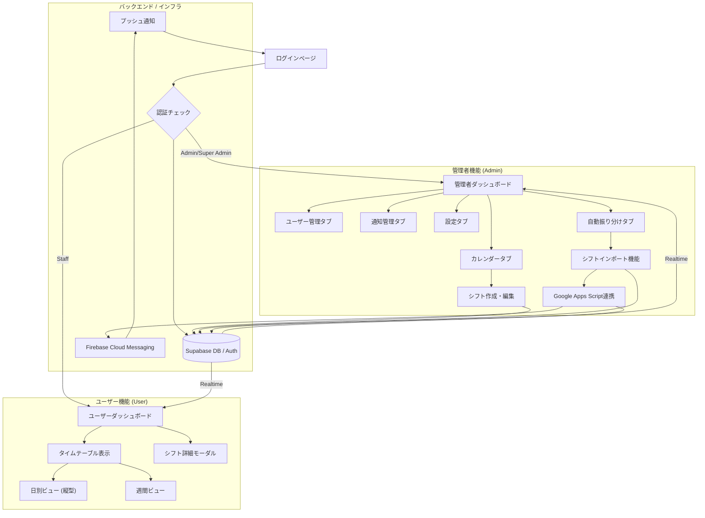
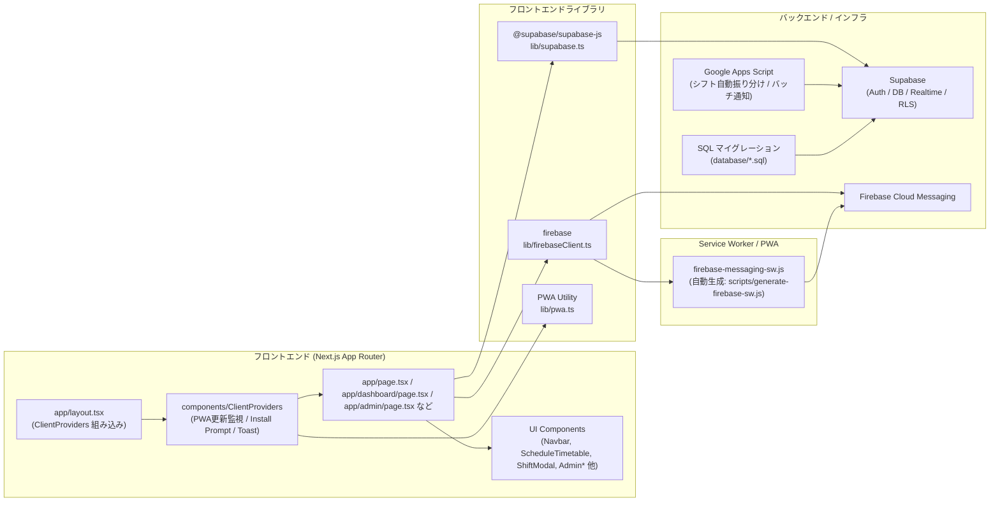

# 文化祭シフト管理システム

文化祭スタッフのシフト管理を行うための **PWA（Progressive Web App）** アプリケーション。  
リアルタイム同期、プッシュ通知、オフライン対応、メンテナンスモード、団体付与シフト機能、チャット機能、シフト自動振り分け、そしてスムーズな UI アニメーションを備えた **フルスタックシステム** である。

## 📋 目次

- [主な機能](#-主な機能)
- [画面・機能一覧](#-画面機能一覧)
- [操作方法](#-操作方法)
- [システムの動作の仕組み（技術解説）](#-システムの動作の仕組み技術解説)
- [API エンドポイント](#-api-エンドポイント)
- [データベース・ドキュメント](#-データベースドキュメント)
- [システム構成図](#-システム構成図)
- [依存関係図](#-依存関係図)
- [技術スタック](#-技術スタック)
- [セットアップ](#-セットアップ)
- [環境変数](#-環境変数)
- [コンポーネント一覧](#-コンポーネント一覧)
- [開発](#-開発)
- [ビルドとデプロイ](#-ビルドとデプロイ)
- [アーキテクチャメモ](#-アーキテクチャメモ)

---

## ✨ 主な機能

### 認証・ユーザー管理

- **Supabase 認証**: メールアドレスとパスワードによる認証システム。
- **ロールベースアクセス制御**: `staff` / `admin` / `super_admin` による権限分離。
  - **`staff`**: 一般スタッフ。自分のシフト閲覧・チャット参加が可能。
  - **`admin`（管理者）**: シフト管理・ユーザー管理・通知送信・チャット管理・メンテナンスモード切り替えなど、日常運用に必要な全機能を利用可能。
  - **`super_admin`（最高管理者）**: システム全体の管理者ロール。`admin` の権限に加え、以下を含む「管理者を管理するための権限」を持つ。
    - 他のユーザーのロール変更（`admin` ⇔ `staff` など）
    - `super_admin` ユーザーの編集・強制ログアウト  
      ※ 通常の `admin` からは `super_admin` を削除・強制ログアウト・ロールダウンできないようガードされている。
- **ログイン状態の永続化**: 最終ログインから 5 日間セッションを保持。古い端末情報・Push トークンは自動クリーンアップ。
- **メンテナンスモード**: 管理者がシステムをメンテナンス状態に切り替え可能（一般ユーザーは専用画面にリダイレクト）。

### 🎨 UI/UX・PWA

- **PWA 対応**: インストール可能であり、オフラインでも一部機能が動作する。ホーム画面に追加してネイティブアプリのように利用可能。
- **iOS / Android 対応**: iOS のホーム画面追加・通知にも対応した Service Worker / FCM 実装。
- **スムーズなモード切り替え**: 管理者モードと通常モード（スタッフビュー）をアニメーション付きでスムーズに切り替え。
- **レスポンシブデザイン**: PC、タブレット、スマートフォン全てのデバイスで最適化されたレイアウト。

### 📅 シフト管理

#### 管理者機能
- **シフト作成・編集**: 個別シフト／団体付与シフト（`shift_groups`）をカレンダーから直感的に登録。
- **自動振り分け取り込み**: 外部 JSON データ（GAS 連携）からシフトを一括インポートし、DB に反映。
- **個別・団体シフト登録**: 個別のスタッフへの割り当てに加え、複数人への一括団体シフト登録が可能。
- **カレンダー・スプレッドシート表示**: 週・月カレンダーと、表形式（スプレッドシート）ビューを切り替え可能。
- **重複チェック**: 時間帯・タイトルなどをもとに、同一時間帯の重複を検知して登録ミスを防止。
- **統括者の設定**: 団体シフト内で統括者（リーダー）を 1 名設定可能。

#### ユーザー（スタッフ）機能
- **タイムテーブル表示**: 当日のスケジュールを **縦型タイムテーブル** で分かりやすく表示（6:00–22:00）。
- **自分専用ダッシュボード**: 自分に紐づくシフトと、自分が統括者となっているシフトのみを統合表示。
- **シフト詳細確認**: シフトタイトル、時間帯、備考、参加メンバー、統括者の情報をモーダルで確認。
- **次のシフトカード**: 進行中／次のシフトをカード形式で強調表示。

### 🔔 プッシュ通知・システム通知

- **自動リマインダー**: シフト開始の 1 時間前・30 分前・5 分前に自動で Push 通知を送信（GAS + FCM）。
- **管理者からの連絡**: 特定ユーザー／シフトグループ単位で手動通知を送信可能（管理画面の通知タブ）。
- **重複表示防止ロジック**: FCM の `messageId` / tag を用いて、同一通知が複数端末・フォアグラウンド/バックグラウンドで二重表示されないよう制御。

### 💬 チャット・コミュニケーション

- **シフトグループチャット**: 団体付与されたシフトグループ単位でチャットルームを生成し、連絡を一元化。
- **既読管理**: 既読情報を Supabase で管理し、未読メッセージを把握可能。
- **通知連携**: 新着メッセージに応じた Push 通知送信（詳細は `database/README_CHAT_NOTIFICATION_FIX.md` および SQL を参照）。

### 🧮 自動振り分け・GAS 連携

- **シフト自動振り分け**: Google Apps Script で作成したスプレッドシートをもとに、シフトグループを自動生成。
- **GAS 連携**: `backend/Code.gs` が Supabase と FCM を連携し、以下を担当する。
  - バッチ通知（開始 1 時間前 / 30 分前 / 5 分前など）の送信
  - 未送信通知の一括処理（HTTP v1 FCM API）
  - 無効トークンのクリーンアップ
- **Webhook 対応**: `doPost` エンドポイントで、任意の通知 ID リストを即時送信する API を提供。

---

## 🧭 画面・機能一覧

### 主要画面

| 画面 | URL | 対象ロール | 主な機能 |
|------|-----|------------|----------|
| ログイン | `/` | 全員 | メールアドレス・パスワードによるログイン、メンテナンス中の案内表示、Push 通知の初期登録。 |
| メンテナンス画面 | `/maintenance` | 一般ユーザー | システムメンテナンス中の案内表示。ログインセッションは維持されるが利用不可。 |
| スタッフダッシュボード | `/dashboard` | staff / admin（ユーザービュー） | 当日〜今後の自分のシフト表示、進行中/次シフトカード、シフト詳細表示。 |
| 管理画面トップ | `/admin` | admin / super_admin | シフト管理・ユーザー管理・通知・チャット・各種設定・自動振り分けのハブ画面。 |

### 管理画面タブ構成

| タブ ID | 表示ラベル | 主担当コンポーネント | 概要 |
|--------|------------|-----------------------|------|
| `calendar` | シフト管理 | `AdminCalendar`, `ShiftModal` | 個別／団体シフトの作成・編集・削除。週／月カレンダーとモバイル専用カレンダーを提供。 |
| `users` | ユーザー管理 | `UserManagement` | プロフィール情報・ロール（admin/staff）の編集、アカウント管理。 |
| `notifications` | 通知 | `AdminNotifications` | 手動プッシュ通知の作成・送信履歴の管理。 |
| `chat` | チャット | `AdminChatManagement` | シフトグループチャットの作成・管理、問題発生時の確認。 |
| `settings` | 設定 | `AdminSettings` | メンテナンスモード切り替え、システム設定（`app_settings` テーブル）管理。 |
| `auto_assignment` | 自動振り分け | `ShiftImportComponent` | GAS から出力された JSON を読み込み、団体シフトを自動登録。 |

---

## 🕹 操作方法

### スタッフ向け（/dashboard）

- **ログイン**: 配布されたメールアドレス・パスワードで `/` からログインする。
- **シフト確認**:
  - 画面上部のカードで、進行中／次のシフトを確認できる。
  - 下部のタイムテーブルで、当日の全シフトが時間軸に沿って表示される。
- **シフト詳細を見る**:
  - タイムテーブル上のシフトブロックをタップ／クリックすると、詳細モーダルが開く。
  - 一緒に入るメンバー一覧、統括者名、備考（説明）が確認できる。
- **団体シフトの確認**:
  - 自分が参加している `shift_groups` のシフトも同じタイムテーブル上に表示される。
  - 統括者として登録されている場合は、シフトタイトルに「（統括）」が付与される。

### 管理者向け（/admin）

- **ログイン・モード切り替え**:
  - admin ロールでログインすると、初回は自動的に `/admin` に遷移する。
  - ビューモードは `localStorage` の `shift-app-view-mode` で保持され、`'admin'` / `'user'` を切り替えることで `/admin` ⇔ `/dashboard` を行き来できる（`Navbar` から切り替え）。

- **シフト管理タブ（calendar）**:
  - 週／月ビューで日付をクリックして新規シフトを作成できる。
  - 既存シフトをクリックすると編集モーダル（`ShiftModal`）が開き、時間・タイトル・担当者・統括者・色などを変更できる。
  - モバイルでは `AdminCalendar` による縦スクロール UI で同様の操作が可能。

- **スプレッドシートビュー**:
  - 「表形式」ボタンを押すと `SpreadsheetView` が開き、ユーザー×時間のマトリクスでシフトを一覧できる。

- **自動振り分け（auto_assignment）**:
  - GAS 側で生成された JSON をアップロードし、`shift_groups` / `shift_assignments` テーブルに一括登録する。
  - エラー時は画面上で詳細メッセージが表示される。

- **ユーザー管理（users）**:
  - プロフィール（表示名など）を編集し、admin / staff のロールを更新する。

- **通知管理（notifications）**:
  - 実行委員からスタッフへ連絡するための Push 通知を作成できる。
  - 特定のユーザー、またはシフトグループ単位で送信対象を指定可能。

- **チャット管理（chat）**:
  - グループチャットの状況確認やトラブルシュートを行う。
  - 通知ポリシーの詳細や問題対応は `database/README_CHAT_NOTIFICATION_FIX.md` を参照。

- **システム設定（settings）**:
  - メンテナンスモードの ON/OFF を切り替え、メンバーへの影響を制御する。

### PWA・プッシュ通知の利用

- **PWA インストール手順**:
  - 開発環境での確認・インストール方法は `docs/PWA_使用方法.md` を参照。
  - 本番モード（`npm run build && npm start` あるいは Vercel デプロイ）でのみ PWA / Service Worker が有効になる。
- **通知許可**:
  - 初回ログイン時、あるいはログインボタン押下後にブラウザから通知権限が求められる。
  - 許可すると、端末ごとの Push トークンが `push_subscriptions` テーブルに登録される（古いトークンは自動クリーンアップされる）。

---

## 🔧 システムの動作の仕組み

### 認証・セッション管理

#### Supabase Auth の統合
- **認証フロー**: `app/page.tsx`（ログインページ）で `supabase.auth.signInWithPassword()` を呼び出し、Supabase Auth が JWT トークンを発行。
- **セッション永続化**: `@supabase/ssr` パッケージを使用し、HTTP-only Cookie にセッション情報を保存。これにより、ページリロード後も認証状態が維持される。
- **ログイン状態の検証**: 各ページ（`/dashboard`, `/admin` など）で `supabase.auth.getUser()` を呼び出し、有効なセッションを確認。無効な場合は `/` にリダイレクト。
- **強制ログアウト**: `/api/admin/force-logout` エンドポイントが、対象ユーザーのパスワードを変更することで全セッションを無効化。クライアント側では 5 秒間隔でセッション有効性をチェックし、無効化を即座に検知。

#### ロールベースアクセス制御（RBAC）
- **プロフィールテーブル**: `profiles` テーブルに `role` カラム（`staff` / `admin` / `super_admin`）を保持。
- **RLS（Row Level Security）**: Supabase の RLS ポリシーにより、データベースレベルでアクセス制御を実現。
  - `staff`: 自分のシフト・通知のみ閲覧可能。
  - `admin`: 全シフト・全ユーザーの閲覧・編集が可能（`super_admin` を除く）。
  - `super_admin`: システム全体の管理権限を持つ。
- **API エンドポイントでの権限チェック**: `/api/admin/*` では、リクエスト元のユーザー ID を取得し、`profiles` テーブルからロールを確認してから処理を実行。

### PWA・Service Worker の動作

#### Service Worker の登録と管理
- **登録タイミング**: `lib/firebaseClient.ts` の `waitForServiceWorker()` 関数が、Firebase Messaging 用の Service Worker（`/firebase-messaging-sw.js`）を登録。
- **iOS 対応**: iOS 16.4 以降では PWA としてインストールされている場合のみ Service Worker が動作。`lib/firebaseClient.ts` で iOS 検出と PWA インストール状態の確認を行い、適切なスコープで登録。
- **Service Worker の生成**: `scripts/generate-firebase-sw.js` が、環境変数を注入して `public/firebase-messaging-sw.js` を生成。ビルド時に `npm run generate-firebase-sw` を実行。

#### PWA 更新の検知と適用
- **更新検知**: `components/PwaUpdateListener.tsx` が、`app_updates` テーブルから最新バージョンを 30 秒間隔でポーリング。新しいバージョンが検出されると、ユーザーに更新を促すトーストを表示。
- **強制リロード**: `lib/pwa.ts` の `forceReloadPwa()` 関数が、すべての Service Worker を unregister し、Cache API のキャッシュをクリアしてからページをリロード。これにより、古いキャッシュが残らず最新版が確実に読み込まれる。

#### オフライン対応
- **next-pwa**: `next.config.ts` で `withPWA()` を適用し、自動的に Service Worker とマニフェストを生成。ただし、開発環境（`NODE_ENV === 'development'`）では無効化。
- **キャッシュ戦略**: 静的アセット（CSS、JS、画像）は Cache First、API リクエストは Network First の戦略を採用（next-pwa のデフォルト）。

### プッシュ通知システム

#### FCM トークンの取得と登録
- **トークン取得フロー**:
  1. ログインボタン押下時に `components/PushNotificationManager.tsx` の `setupPushNotificationsForUser()` が呼び出される（ユーザー操作に紐づくため、ブラウザが通知権限を要求可能）。
  2. `Notification.requestPermission()` で通知権限を要求。
  3. `lib/firebaseClient.ts` の `getFcmToken()` が、Firebase SDK の `getToken()` を呼び出して FCM トークンを取得（最大 3 回再試行、2 秒・5 秒・10 秒間隔）。
  4. 取得したトークンを `push_subscriptions` テーブルに保存。同じ `user_id` で複数のトークンがある場合、最新の 1 つだけを残して古いものを削除。

#### 通知の送信フロー（GAS + FCM）
- **通知キュー**: 管理者が通知を作成すると、`notifications` テーブルに `scheduled_at`（送信予定時刻）と `sent_at`（送信済み時刻、初期値は NULL）を保存。
- **バッチ処理**: `backend/Code.gs` の `processNotifications()` 関数が、1 分間隔の時間トリガーで実行される。
  1. `notifications` テーブルから `scheduled_at <= 現在時刻` かつ `sent_at IS NULL` の通知を取得（最大 50 件、`BATCH_SIZE`）。
  2. 各通知について、`mark_notification_sent_atomic` RPC 関数を呼び出して `sent_at` を更新（アトミックな更新により、重複処理を防止）。
  3. 対象ユーザーの `push_subscriptions` から FCM トークンを取得（最新の 1 つだけ）。
  4. FCM HTTP v1 API を使用して通知を送信。通知 ID から一意の `messageId` を生成し、重複防止に利用。
  5. 無効トークン（404/410/UNREGISTERED）が返された場合、`push_subscriptions` から自動削除。

#### 通知の重複防止
- **messageId ベースの重複防止**: GAS 側で通知 ID から `messageId` を生成し、FCM の `data.messageId` と WebPush の `headers.Tag` に設定。クライアント側（`lib/firebaseClient.ts`）と Service Worker 側（`firebase-messaging-sw.js`）で、同じ `messageId` の通知が既に処理済みかチェックし、重複表示を防止。
- **フォアグラウンド/バックグラウンドの両対応**: 
  - フォアグラウンド時: `onMessage()` コールバックで通知を表示。Service Worker に処理済みか確認し、重複を防止。
  - バックグラウンド時: Service Worker の `onBackgroundMessage()` で通知を表示。同じ `messageId` チェックを実施。

#### Webhook による即時送信
- **doPost エンドポイント**: `backend/Code.gs` の `doPost()` 関数が、Web アプリとして公開され、POST リクエストで `notification_ids` の配列を受け取る。
- **即時処理**: 指定された通知 ID に対応する通知を取得し、`processSingleNotification()` を呼び出して即座に送信。管理者が手動で通知を送信する際に利用。

### リアルタイム同期

#### Supabase Realtime の利用
- **チャネル購読**: `/dashboard` と `/admin` で、Supabase Realtime のチャネルを購読。
  ```typescript
  const channel = supabase
    .channel('public:shifts_dashboard')
    .on('postgres_changes', { event: '*', schema: 'public', table: 'shifts' }, () => {
      loadShiftsForUser(user)
    })
    .on('postgres_changes', { event: '*', schema: 'public', table: 'shift_groups' }, () => {
      loadShiftsForUser(user)
    })
  channel.subscribe()
  ```
- **監視対象テーブル**: `shifts`, `shift_groups`, `shift_assignments`, `profiles` の変更を監視し、変更が検出されると自動的にデータを再取得して画面を更新。
- **補完的なポーリング**: Realtime の接続が切れた場合に備え、30 秒間隔でデータを再取得（`setInterval`）。

#### セッション監視
- **定期的なセッションチェック**: `/dashboard` と `/admin` で、5 秒間隔で `supabase.auth.getUser()` を呼び出し、セッションの有効性を確認。無効な場合（強制ログアウトなど）は即座にログアウト処理を実行。

### シフト管理のデータ構造

#### 個別付与シフト（`shifts` テーブル）
- **構造**: `user_id`（担当者）、`title`（シフト名）、`start_time` / `end_time`（時間帯）、`supervisor_id`（統括者、オプション）、`description`（備考）、`color`（表示色）を保持。
- **用途**: 特定のスタッフに個別に割り当てるシフト。後方互換性のため保持。

#### 団体付与シフト（`shift_groups` + `shift_assignments`）
- **`shift_groups` テーブル**: シフトの「枠」を定義。`title`、`start_time` / `end_time`、`description`、`color` を保持。
- **`shift_assignments` テーブル**: シフトグループとユーザーの紐づけ。`shift_group_id`、`user_id`、`is_supervisor`（統括者フラグ）を保持。
- **利点**: 複数人に同じシフトを一括で割り当て可能。参加者の追加・削除が容易。

#### シフトの取得ロジック
- **ユーザーダッシュボード**: 
  1. `shifts` テーブルから `user_id = 現在のユーザーID` のシフトを取得。
  2. `shift_assignments` から `user_id = 現在のユーザーID` の割り当てを取得し、対応する `shift_groups` を結合。
  3. 統括者として設定されているシフト（`supervisor_id = 現在のユーザーID`）も取得。
  4. すべてを統合してタイムテーブルに表示。

### チャット機能

#### チャットルームの生成
- **シフトグループ単位**: 各 `shift_groups` に対応するチャットルームが自動的に生成される（`shift_group_chat_messages` テーブルで `shift_group_id` をキーに管理）。
- **参加権限**: `shift_assignments` に登録されているユーザーのみがチャットに参加可能。管理者は全チャットにアクセス可能。

#### メッセージ送信と画像アップロード
- **メッセージ送信**: `components/GroupChat.tsx` が、`shift_group_chat_messages` テーブルにメッセージを INSERT。
- **画像アップロード**: Supabase Storage の `shift-chat-images` バケットに画像をアップロードし、`image_url` をメッセージに紐づけ。ファイルサイズ上限は 5MB。
- **リプライ機能**: `reply_to` カラムに元メッセージの ID を保存し、UI でリプライ先を表示。

#### 既読管理
- **既読レコード**: `shift_group_chat_read_receipts` テーブルに、`message_id` と `user_id` の組み合わせで既読情報を保存。
- **既読の記録**: メッセージ一覧を取得した際、自分の既読レコードがないメッセージに対して自動的に既読レコードを作成（`upsert`）。

#### チャット通知
- **通知作成**: メッセージ送信時に、同じシフトグループの参加者（送信者を除く）に対して通知を作成。`create_chat_notification` RPC 関数（`security definer`）を使用し、RLS をバイパスして通知を作成。
- **通知ポリシー**: `database/README_CHAT_NOTIFICATION_FIX.md` に詳細な修正手順が記載されている。RLS ポリシーにより、シフトグループの参加者のみが通知を作成可能。

### メンテナンスモード

#### 実装の仕組み
- **設定の保存**: `app_settings` テーブルの `key = 'maintenance_mode'`、`value = 'true' / 'false'` で状態を管理。
- **アクセス制御**: 各ページ（`/dashboard`, `/admin` など）で、メンテナンスモードが有効かつユーザーが `admin` / `super_admin` でない場合、`/maintenance` にリダイレクト。
- **自動復帰**: `/maintenance` ページが 5 秒間隔でメンテナンスモードをチェックし、解除されると自動的に `/dashboard` にリダイレクト。

### データフロー図

#### シフト作成フロー
```
管理者がシフトを作成
  ↓
ShiftModal.tsx でフォーム送信
  ↓
Supabase に INSERT（shifts または shift_groups + shift_assignments）
  ↓
Supabase Realtime が変更を検知
  ↓
全クライアントの画面が自動更新
```

#### 通知送信フロー
```
管理者が通知を作成
  ↓
notifications テーブルに INSERT（scheduled_at を設定）
  ↓
GAS の processNotifications() が 1 分間隔で実行
  ↓
scheduled_at <= 現在時刻 かつ sent_at IS NULL の通知を取得
  ↓
mark_notification_sent_atomic() で sent_at を更新（ロック）
  ↓
push_subscriptions から FCM トークンを取得
  ↓
FCM HTTP v1 API で通知を送信
  ↓
クライアント側（Service Worker または onMessage）で通知を表示
```

---

## 🛰 API エンドポイント

Next.js App Router の API ルートと GAS Webhook による **管理系 API** の概要。

### Next.js API（`app/api`）

| パス | メソッド | 用途 | 概要 |
|------|----------|------|------|
| `/api/admin/get-users` | GET | ユーザー一覧取得 | Supabase の `profiles` からユーザー一覧を取得し、管理画面ユーザータブで利用。 |
| `/api/admin/create-user` | POST | 単体ユーザー作成 | メール・表示名・ロールを受け取り、Supabase Auth と `profiles` にユーザーを作成。 |
| `/api/admin/bulk-create-users` | POST | 一括ユーザー作成 | CSV/JSON を元に複数ユーザーを一括作成。 |
| `/api/admin/update-user` | POST/PUT | ユーザー更新 | ロール変更や表示名の更新など、ユーザー情報を更新。`super_admin` の保護ロジックを含む。 |
| `/api/admin/group/logout-users` | POST | 複数ユーザー強制ログアウト | 対象ユーザーのセッションを失効させ、`force-logout` と連携。 |
| `/api/admin/group/delete-users` | POST | 複数ユーザー削除 | 指定グループ内ユーザーを一括削除するユーティリティ。 |
| `/api/admin/group/rename` | POST | グループ名変更 | グループチャットやシフトグループ名の更新に利用。 |
| `/api/admin/force-logout` | POST | 単体強制ログアウト | 特定ユーザーを即時ログアウトさせる（パスワード変更により全セッションを無効化）。ダッシュボード・管理画面のセッション監視と連携。 |

> 詳細なリクエストボディやレスポンス形式は各 `route.ts` を参照。

### Google Apps Script Webhook（`backend/Code.gs`）

| 関数 | エンドポイント種別 | 用途 |
|------|-------------------|------|
| `processNotifications` | 時間トリガー | `notifications` テーブルの未送信通知を定期的に処理し、FCM 経由で配信。1 分間隔で実行。 |
| `doGet` | Web アプリ GET | 動作確認用の簡易ステータスエンドポイント。 |
| `doPost` | Web アプリ POST | `notification_ids` の配列を受け取り、対象通知を即時送信する Webhook。 |

---

## 🗄 データベース・ドキュメント

Supabase/PostgreSQL 上のテーブル群と、その運用に関するドキュメント。

### 主なテーブル（抜粋）

- **`profiles`**: ユーザープロフィール（表示名・ロール `admin` / `staff` / `super_admin` など）。
- **`shifts`**: 個別付与シフト。ユーザーごとのシフトを直接管理。
- **`shift_groups`**: 団体シフト（グループ単位の枠）。タイトル・時間帯・説明・カラーなど。
- **`shift_assignments`**: シフトグループとユーザーの紐づけ。統括者フラグ `is_supervisor` を含む。
- **`notifications`**: プッシュ通知キュー。`scheduled_at` / `sent_at` により未送信・済みを管理。
- **`push_subscriptions`**: 端末ごとの FCM トークン。GAS によるクリーンアップ・無効トークン削除対象。
- **`app_settings`**: メンテナンスモードなどシステム設定キー。
- **`app_updates`**: PWA 更新検知用。`version` と `created_at` を保持。
- **`shift_group_chat_messages`**: シフトグループチャットのメッセージ。`shift_group_id`、`user_id`、`message`、`image_url`、`reply_to` を保持。
- **`shift_group_chat_read_receipts`**: チャットメッセージの既読情報。`message_id` と `user_id` の組み合わせで管理。

### 運用・トラブルシュート用ドキュメント

- `database/README_CHAT_NOTIFICATION_FIX.md`  
  - チャット通知作成時の RLS ポリシーエラーに対する最終的な修正内容と手順。
- `database/TROUBLESHOOTING_NOTIFICATIONS.md`  
  - 通知作成時の 403 / RLS エラーの診断・修正フロー。
- `docs/PWA_使用方法.md`  
  - 開発・本番環境での PWA 動作確認手順、インストール方法。
- `docs/iOS_PWA_設定ガイド.md` / `docs/iOS_PWA_トラブルシューティング.md`  
  - iOS Safari / ホーム画面追加時の注意点や、通知が来ない場合のチェックリスト。
- `docs/CSS確認方法.md`  
  - PWA キャッシュに影響されず CSS を確認・更新するための手順。

---

## 🗺 システム構成図

アプリケーションの主要コンポーネントとデータフローの概要図である。



## 🧱 依存関係図

フロントエンド、バックエンド、および外部サービス間の依存関係を示す。



---

## 🛠 技術スタック

### フロントエンド

- **Next.js 16**: App Routerを使用した最新のReactフレームワーク。Server Components と Client Components を適切に使い分け。
- **React 19**: 最新機能を使用したUI構築。
- **TypeScript**: 型安全性による堅牢なコード。
- **Tailwind CSS 4**: ユーティリティファーストなスタイリング。
- **framer-motion / CSS Animations**: スムーズな遷移エフェクト。

### バックエンド・インフラ

- **Supabase**: 認証、データベース、リアルタイム配信、RLS（行レベルセキュリティ）。
- **Firebase Cloud Messaging (FCM)**: プッシュ通知基盤。HTTP v1 API を使用。
- **Google Apps Script (GAS)**: 通知のバッチ処理および外部データ連携。

---

## 🚀 セットアップ

### 1. リポジトリのクローンとインストール

```bash
git clone <repository-url>
cd shift-app
npm install
```

### 2. 環境変数の設定

`.env.local`ファイルを作成し、以下の値を設定する。

```bash
NEXT_PUBLIC_SUPABASE_URL=your_supabase_url
NEXT_PUBLIC_SUPABASE_ANON_KEY=your_supabase_anon_key
SUPABASE_SERVICE_ROLE_KEY=your_service_role_key

NEXT_PUBLIC_FIREBASE_API_KEY=your_firebase_api_key
NEXT_PUBLIC_FIREBASE_AUTH_DOMAIN=your_project.firebaseapp.com
NEXT_PUBLIC_FIREBASE_PROJECT_ID=your_project_id
NEXT_PUBLIC_FIREBASE_MESSAGING_SENDER_ID=your_sender_id
NEXT_PUBLIC_FIREBASE_APP_ID=your_app_id
NEXT_PUBLIC_FIREBASE_VAPID_KEY=your_vapid_key

# オプション: 強制ログアウト時の認証パスワード（super_admin 以外の場合）
ADMIN_FORCE_LOGOUT_PASSWORD=your_secure_password
```

### 3. Service Workerの生成

```bash
npm run generate-firebase-sw
```

### 4. 開発サーバーの起動

```bash
npm run dev
```

http://localhost:3000 でアプリケーションにアクセス可能となる。

---

## 🧩 コンポーネント一覧

主要なコンポーネントとその役割は以下の通り（抜粋）。

### 画面系

| コンポーネント名 | 説明 |
|------------------|------|
| `Navbar.tsx` | 画面上部のナビゲーションバー。モード切り替え（admin/user）、ログアウトなどを提供。ビューモードは `localStorage` で永続化。 |
| `ScheduleTimetable.tsx` | ユーザーダッシュボードのタイムテーブル表示。縦型（日）とリスト型（週）を切り替え可能。CSS の絶対配置で時間軸に沿ってシフトを配置。 |
| `ShiftDetailModal.tsx` | シフト詳細表示モーダル。参加メンバー一覧、統括者名、説明などを表示。統括者はシフト説明を編集可能。 |
| `ShiftModal.tsx` | 管理者向けシフト作成・編集モーダル。個別／団体シフト、統括者・色設定などを行う。テンプレート機能も提供。 |
| `AdminCalendar.tsx` | 管理者用のモバイル向けカレンダーコンポーネント。日付タップでシフト作成。 |
| `SpreadsheetView.tsx` | シフトの表形式ビュー。ユーザー×時間帯のマトリクスでシフトを俯瞰。 |
| `UserManagement.tsx` | ユーザーのアカウント作成・編集・ロール管理。`super_admin` の保護ロジックを含む。 |
| `AdminNotifications.tsx` | 管理者による Push 通知の作成・送信 UI。特定ユーザーまたはシフトグループ単位で送信可能。 |
| `AdminSettings.tsx` | メンテナンスモード切り替え、システム設定（`app_settings` テーブル）管理。 |
| `AdminChatManagement.tsx` | 管理者用チャット管理画面。グループチャットや通知トラブルの状況確認。 |
| `GroupChat.tsx` | シフトグループチャット画面。メッセージ送受信と簡易 UI を提供。画像アップロード、リプライ機能を含む。 |

### PWA / 通知・インフラ系

| コンポーネント名 | 説明 |
|------------------|------|
| `ClientProviders.tsx` | 全ページをラップし、PWA 更新監視・インストール促進・Toast を提供。 |
| `PwaUpdateListener.tsx` | `app_updates` テーブルから最新バージョンを 30 秒間隔でポーリングし、新しいバージョンが検出されると更新を促すトーストを表示。 |
| `PwaInstallPrompt.tsx` | PWA インストールが可能な環境で、ユーザーにホーム画面追加を促す。 |
| `FcmTokenManager.tsx` | ログイン済みユーザーの FCM トークン登録・更新を管理。定期的にトークンの有効性を確認。 |
| `PushNotificationManager.tsx` | ログイン時に通知権限を要求し、トークンとユーザー ID を Supabase に登録。最大 3 回の再試行ロジックを含む。 |
| `NotificationToast.tsx` | 画面内のステータスやエラーなどをトースト表示。 |
| `ToastProvider.tsx` | 全体のトーストコンテキストを提供。 |

### ライブラリ / 型定義

| ファイル名 | 説明 |
|-----------|------|
| `lib/supabase.ts` | クライアントサイド用 Supabase クライアント生成。`@supabase/ssr` の `createBrowserClient` を使用。環境変数が未設定の場合はビルド時エラーを抑止するダミークライアントも提供。 |
| `lib/firebaseClient.ts` | Firebase / FCM の初期化、Service Worker 登録待ち、トークン取得、In-App 通知ハンドリング。iOS 対応と重複防止ロジックを含む。 |
| `lib/pwa.ts` | Service Worker の unregister と Cache クリアを行い、PWA を強制リロード。 |
| `lib/colorUtils.ts` | シフトカラーとテキストカラーのコントラスト計算（WCAG 2.0 基準）、透過度付与などのユーティリティ。 |
| `lib/types.ts` | `Profile`, `Shift`, `ShiftGroup`, `ShiftAssignment`, `ShiftGroupChatMessage` など、主要エンティティの TypeScript 型定義。 |

---

## 🧑‍💻 開発

- **開発サーバー起動**:  
  ```bash
  npm run dev
  ```
- **コード整形・静的解析**:  
  ```bash
  npm run lint
  ```
- **Service Worker の再生成のみ行いたい場合**:  
  ```bash
  npm run generate-firebase-sw
  ```
- **アイコン一式の再生成（`public/` 配下）**:  
  ```bash
  npm run generate-icons
  ```

---

## 🏗 ビルドとデプロイ

本番環境向けにビルドするには以下のコマンドを実行する。

```bash
npm run build
```

その後、ローカルで本番モードを確認する場合は以下を実行する。

```bash
npm start
```

Vercel などのプラットフォームにデプロイする際は、環境変数をダッシュボード設定にコピーすること。

---

## 🏛 アーキテクチャメモ

### タイムテーブル表示ロジック
ユーザーダッシュボードでは、当日のシフトを視覚的に把握しやすくするため、縦軸に時間をとったタイムテーブルレイアウトを採用している。CSS の絶対配置を利用して、開始時刻と終了時刻に基づいた高さと位置を計算し、ブロックを描画する。

### モード切り替えアニメーション
`Navbar` コンポーネント内で状態管理を行い、切り替え時に全画面のオーバーレイを表示することで、アプリのようなスムーズな遷移体験を提供している。`localStorage` にビューモードを保存し、ページリロード後も状態を維持。

### 通知・チャットポリシー
通知・チャットに関する RLS・ポリシー・トラブルシュートは、`docs` ディレクトリ以下の SQL とドキュメントに詳細がある。
- `docs/README_CHAT_NOTIFICATION_FIX.md`: チャット通知周りの最終的な修正内容のまとめ。
- `docs/TROUBLESHOOTING_NOTIFICATIONS.md`: 通知が届かない場合の確認手順と典型的な修正 SQL。

### Realtime・強制ログアウト
- `/dashboard` と `/admin` は Supabase Realtime のチャネルを利用し、`shifts` / `shift_groups` / `shift_assignments` / `profiles` の変更を即時反映する。
- セッションチェックを 5 秒間隔で行い、管理画面からの強制ログアウト（`/api/admin/force-logout` など）をほぼリアルタイムに適用する。

### パフォーマンス最適化
- **データ取得の最適化**: 必要なデータのみを取得し、JOIN を最小限に抑える。
- **キャッシュ戦略**: next-pwa による静的アセットのキャッシュ、Service Worker によるオフライン対応。
- **リアルタイム更新の補完**: Realtime の接続が切れた場合に備え、30 秒間隔のポーリングを実施。

### セキュリティ
- **RLS（Row Level Security）**: Supabase の RLS ポリシーにより、データベースレベルでアクセス制御を実現。ユーザーは自分のデータのみアクセス可能。
- **API エンドポイントの権限チェック**: すべての管理系 API で、リクエスト元のユーザー ID とロールを確認。
- **`super_admin` の保護**: 通常の `admin` からは `super_admin` を削除・強制ログアウト・ロールダウンできないよう、API レベルでガード。

---
最終更新:2025/12/25

© 2025 Junxiang Jin & 市川学園なずな祭実行委員会. All rights reserved.
